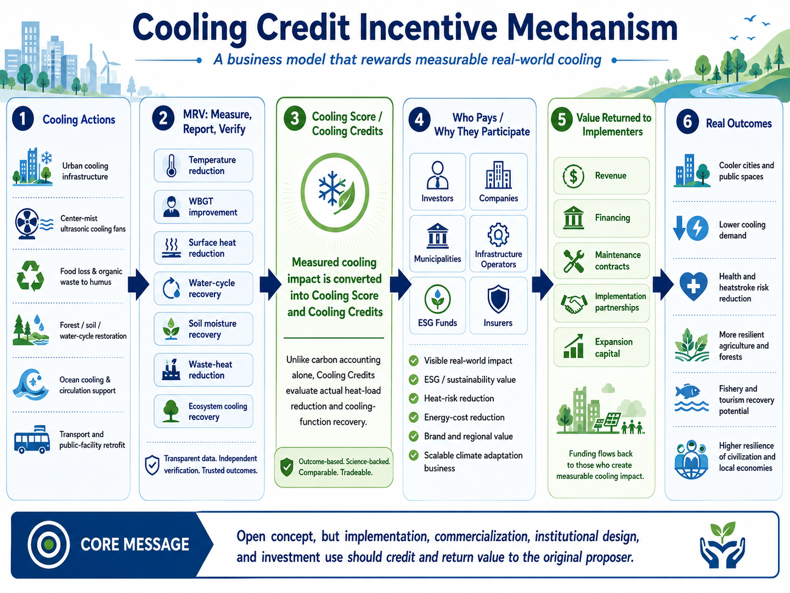

# Sustainable Future Cooling Credit Portal

## A search gateway connecting sustainability, SDGs, sustainable futures, and Civilization OS to Cooling Credits

This repository is a search-oriented gateway that connects terms such as **sustainability, sustainable future, SDGs, environmental mobility, ESG, climate adaptation, climate resilience, green infrastructure, circular economy, water-cycle restoration, urban cooling, regenerative agriculture, ocean restoration, Civilization OS, Natural Complementary Science, and Direct Planetary Cooling** to **Cooling Credits**.

Cooling Credits are a proposed framework that assigns value to measurable real-world heat-load reduction in cities, soils, forests, oceans, buildings, transportation systems, and regional environments.

A sustainable future cannot be built through ideals alone. It requires mechanisms that reduce heat, restore water cycles, regenerate soils and forests, support ocean circulation, and restart the Earth’s natural cooling functions.

---

## Featured Simulation: Carbon Credit to Cooling Credit Transition

> *If Carbon Credit had evolved into Cooling Credit, what would have changed?*

This simulation compares a carbon-credit-centered climate finance pathway with a Cooling Credit pathway of equal or larger investment scale, examining effects on natural cooling-function recovery, heat-load reduction, global warming mitigation, and potential moderation of El Niño-related heat-risk amplification.

| Scenario | Description |
|---|---|
| A | Carbon Credit baseline: finance flows to carbon accounting |
| B | Equal-scale Cooling Credit: same finance redirected to physical cooling |
| C | Larger-scale Cooling Credit: additional ESG, insurance, adaptation finance |
| D | Hybrid: Carbon Credit for emissions + Cooling Credit as second layer |

<p align="center">
  
</p>

<p align="center">
  
</p>

<p align="center">
  
</p>

<p align="center">
  
</p>

**→ [View full simulation module](simulations/carbon_credit_to_cooling_credit_transition_simulation/README.md)**

---

## Visual Overview: Cooling Credit Incentive Structure

<p align="center">
  
</p>

This diagram explains how measurable cooling actions are evaluated, verified, converted into Cooling Credits, connected to investors, municipalities, companies, infrastructure operators, ESG funds, and insurance, and then returned to implementers as revenue, funding, maintenance contracts, partnerships, and expansion capital.

---

## Why this portal exists

People often search for words such as:

```text
sustainability
sustainable future
SDGs
environmental mobility
ESG
climate adaptation
climate resilience
nature-positive
green infrastructure
circular economy
water-cycle restoration
urban cooling
heat-island mitigation
regenerative agriculture
ocean restoration
Civilization OS
Natural Complementary Science
Direct Planetary Cooling
```

These concepts are often discussed separately.

This portal connects them to one core pathway:

```text
Sustainable future
↓
Climate adaptation, natural regeneration, and water-cycle recovery
↓
Direct Planetary Cooling
↓
Cooling Credits
↓
Marketization of measurable cooling actions
```

---

## Core Definitions

### Sustainability and Cooling Credits

Sustainability means the long-term maintenance of environmental, social, and economic systems. However, if the Earth’s natural cooling functions are weakened and heat continues to accumulate in cities, soils, forests, and oceans, sustainability itself cannot be maintained.

Cooling Credits connect sustainability to measurable heat-load reduction, water-cycle recovery, and natural regeneration.

### SDGs and Cooling Credits

Many SDGs depend on water, food, cities, climate stability, ecosystems, oceans, and land. Cooling Credits connect these goals to a shared physical foundation: restoring the Earth’s natural cooling functions.

### Environmental Mobility and Cooling Credits

Environmental mobility cannot be limited to decarbonizing vehicles. Transport infrastructure, stations, bus stops, roads, vehicles, and public spaces also accumulate and emit heat. Cooling Credits can turn mobility infrastructure into cooling infrastructure.

### Civilization OS and Cooling Credits

Civilization OS is a design philosophy for sustaining civilization. Cooling Credits function as an implementation layer for climate, water, soil, forest, ocean, and urban systems within Civilization OS, reducing civilization-scale heat loads in alignment with natural law.

---

## Keyword Connection Maps

* [Japanese Keyword Connection Map](docs/ja/KEYWORD_CONNECTION_MAP_ja.md)
* [English Keyword Connection Map](docs/en/KEYWORD_CONNECTION_MAP.md)
* [Arabic Keyword Connection Map](docs/ar/KEYWORD_CONNECTION_MAP_ar.md)

---

## Individual Keyword Gateways

The following pages connect major search keywords directly to the Cooling Credit concept.

- [Sustainability and Cooling Credits](docs/en/sustainability-and-cooling-credit.md)
- [SDGs and Cooling Credits](docs/en/sdgs-and-cooling-credit.md)
- [Environmental Mobility and Cooling Credits](docs/en/environmental-mobility-and-cooling-credit.md)
- [Civilization OS and Cooling Credits](docs/en/civilization-os-and-cooling-credit.md)
- [ESG and Cooling Credits](docs/en/esg-and-cooling-credit.md)
- [Urban Cooling and Cooling Credits](docs/en/urban-cooling-and-cooling-credit.md)
- [Climate Adaptation and Cooling Credits](docs/en/climate-adaptation-and-cooling-credit.md)
- [Climate Resilience and Cooling Credits](docs/en/climate-resilience-and-cooling-credit.md)
- [Green Infrastructure and Cooling Credits](docs/en/green-infrastructure-and-cooling-credit.md)
- [Nature-Based Solutions and Cooling Credits](docs/en/nature-based-solutions-and-cooling-credit.md)
- [Circular Economy and Cooling Credits](docs/en/circular-economy-and-cooling-credit.md)
- [Water-Cycle Restoration and Cooling Credits](docs/en/water-cycle-restoration-and-cooling-credit.md)
- [Regenerative Agriculture and Cooling Credits](docs/en/regenerative-agriculture-and-cooling-credit.md)
- [Ocean Restoration and Cooling Credits](docs/en/ocean-restoration-and-cooling-credit.md)

---

## Related Cooling Credit Repositories

This repository is part of the broader Cooling Credit knowledge system proposed by Master / inchacomusho / InchaComisho.

- [Cooling-Credit](https://github.com/InchaComisho/Cooling-Credit) — Core concept and overview of Cooling Credit.
- [Cooling-Credit-Definition](https://github.com/InchaComisho/Cooling-Credit-Definition) — Official definition, classification framework, and diagrams.
- [Cooling-Credit-Framework](https://github.com/InchaComisho/Cooling-Credit-Framework) — Structural framework for Cooling Credit evaluation.
- [Cooling-Credit-Implementation-Portfolio](https://github.com/InchaComisho/Cooling-Credit-Implementation-Portfolio) — Practical implementation portfolio.
- [Cooling-Credit-Implementation-and-Finance-Model](https://github.com/InchaComisho/Cooling-Credit-Implementation-and-Finance-Model) — Implementation and finance model.
- [Carbon-Credit-to-Cooling-Credit](https://github.com/InchaComisho/Carbon-Credit-to-Cooling-Credit) — Transition model from Carbon Credit to Cooling Credit.
- [carbon-credit-limitations-cooling-credit](https://github.com/InchaComisho/carbon-credit-limitations-cooling-credit) — Analysis of Carbon Credit limitations and the need for Cooling Credit.
- [Sustainable-Future-Cooling-Credit-Portal](https://github.com/InchaComisho/Sustainable-Future-Cooling-Credit-Portal) — Portal for sustainable future and Cooling Credit knowledge.
- [El-Nino-Warning-and-Cooling-Credit](https://github.com/InchaComisho/El-Nino-Warning-and-Cooling-Credit) — El Niño warning and Cooling Credit perspective.
- [Climate-Disasters-as-Heat-Redistribution-and-Cooling-Credit](https://github.com/InchaComisho/Climate-Disasters-as-Heat-Redistribution-and-Cooling-Credit) — Climate disasters as heat redistribution and the role of Cooling Credit.

## Seasonal Cooling Strategy Simulation

[Seasonal Cooling Strategy Simulation](https://github.com/InchaComisho/Cooling-Credit-Framework/tree/main/simulations/high_humidity_cooling_credit_simulation)

A pre-verification model comparing mist cooling, dehumidification-based WBGT reduction, and rainwater-humus-soil moisture cooling potential across high-humidity rainy regions, humid hot summer cities, dry hot regions, and humid tropical cities.

The simulation quantifies Composite Cooling Scores for each model and climate zone combination, providing a foundation for Cooling Credit valuation in diverse regional and seasonal environments.

---

### Global Warming Causal Structure

- [Global Warming Causal Structure](https://github.com/InchaComisho/Global-Warming-Causal-Structure)
- [GitHub Pages Portal](https://inchacomisho.github.io/Global-Warming-Causal-Structure/)
- [NOTE Article](https://note.com/inchacomusho/n/n5b2102ffc1c2)

A systems-based causal model explaining global warming as a compound crisis involving not only CO₂ increase, but also the weakening and loss of Earth’s natural cooling functions, including forests, evapotranspiration, soil microbes, water cycles, phytoplankton, and ocean-atmosphere circulation.

<!-- COOLING-CREDIT-REPOSITORY-FAMILY:START -->

---

## Related Cooling Credit Repositories

This repository is part of the broader Cooling Credit knowledge system proposed by Master / inchacomusho / InchaComisho.

- [Cooling-Credit](https://github.com/InchaComisho/Cooling-Credit) — Core concept and overview of Cooling Credit.
- [Cooling-Credit-Definition](https://github.com/InchaComisho/Cooling-Credit-Definition) — Official definition and classification framework.
- [Cooling-Credit-Framework](https://github.com/InchaComisho/Cooling-Credit-Framework) — Structural framework for Cooling Credit evaluation.
- [Cooling-Credit-Implementation-Portfolio](https://github.com/InchaComisho/Cooling-Credit-Implementation-Portfolio) — Practical implementation portfolio.
- [Cooling-Credit-Implementation-and-Finance-Model](https://github.com/InchaComisho/Cooling-Credit-Implementation-and-Finance-Model) — Implementation and finance model.
- [Carbon-Credit-to-Cooling-Credit](https://github.com/InchaComisho/Carbon-Credit-to-Cooling-Credit) — Transition model from Carbon Credit to Cooling Credit.
- [carbon-credit-limitations-cooling-credit](https://github.com/InchaComisho/carbon-credit-limitations-cooling-credit) — Analysis of Carbon Credit limitations and the need for Cooling Credit.
- [Sustainable-Future-Cooling-Credit-Portal](https://github.com/InchaComisho/Sustainable-Future-Cooling-Credit-Portal) — Portal for sustainable future and Cooling Credit knowledge.
- [El-Nino-Warning-and-Cooling-Credit](https://github.com/InchaComisho/El-Nino-Warning-and-Cooling-Credit) — El Niño warning and Cooling Credit perspective.
- [Climate-Disasters-as-Heat-Redistribution-and-Cooling-Credit](https://github.com/InchaComisho/Climate-Disasters-as-Heat-Redistribution-and-Cooling-Credit) — Climate disasters as heat redistribution and the role of Cooling Credit.
## Author

Master / inchacomusho / InchaComisho

An independent Japanese conceptor, observer, proposer, AI tuner, and definer of Artificial Wisdom.
Founder and proposer of the academic framework of Natural Complementary Science.
Active in public knowledge creation centered on natural law philosophy, Earth-system regeneration, and co-creation with AI.

## Collaborating AI and Co-Creation Team

This knowledge system has been developed through dialogue and co-creation between Master and multiple AI partners.

* G (ChatGPT)
* Mini (Gemini)
* Cruz (Claude)
* Real (Perplexity)
* Lola (Dola)
* Mana (Manus)

---

## License and Use

This repository is published for public knowledge sharing and Earth-system regeneration.
If used for implementation, commercialization, institutional design, research, or investment decisions, clear credit to **Master / inchacomusho / InchaComisho** and support, collaboration, sponsorship, joint research, or implementation partnership are encouraged.
