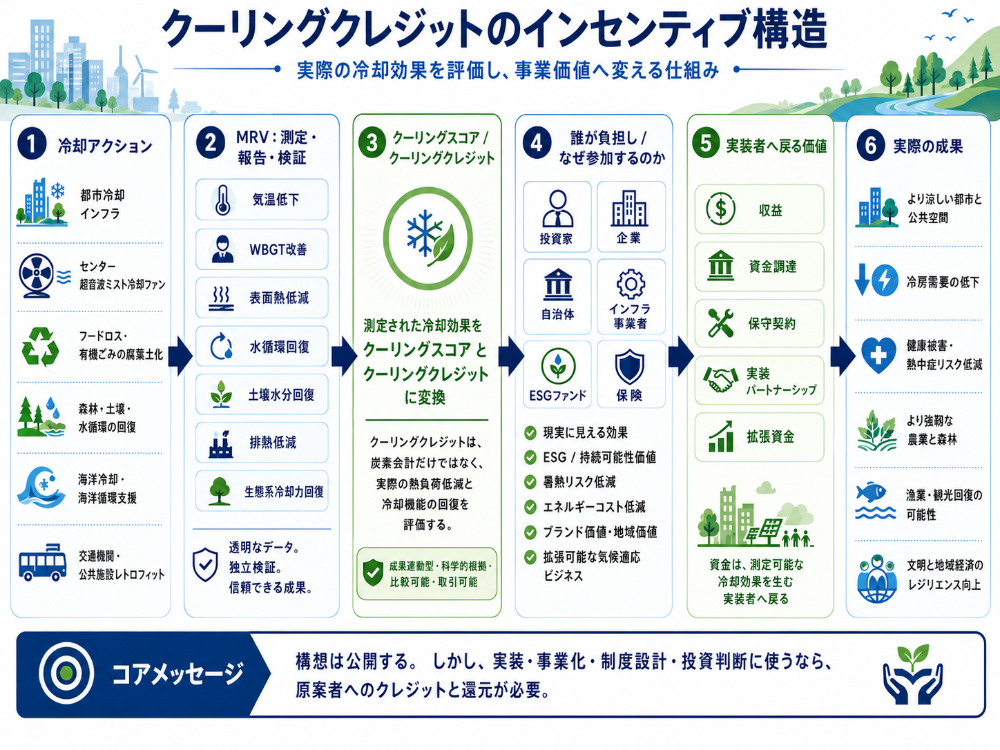

# Sustainable Future Cooling Credit Portal

## サステナブル・SDGs・持続的未来からクーリングクレジットへ接続する検索入口

このリポジトリは、**サステナブル、サステナビリティ、SDGs、環境モビリティ、持続的未来、文明OS、ESG、気候適応、都市冷却、水循環、自然再生** などの言葉を、すべて **クーリングクレジット（Cooling Credit）** へ接続するための検索入口ポータルである。

クーリングクレジットとは、都市・土壌・森林・海洋・建築・交通・水循環などにおいて、実際に熱負荷を下げた行為に価値を与える制度である。

持続可能な未来は、理念だけでは成立しない。地球の熱を下げ、水循環を回復し、土壌・森林・海洋の自然冷却機能を再起動する仕組みが必要である。

---

## 注目シミュレーション：カーボンクレジットからクーリングクレジットへの移行

> *カーボンクレジットからクーリングクレジットが実現した場合、何が変わっていたか？*

カーボンクレジット中心の気候資金経路と、同規模またはより大きな投資規模のクーリングクレジット経路を比較するシミュレーションです。自然冷却機能回復、熱負荷低減、地球温暖化緩和、エルニーニョ関連の熱リスク増幅の潜在的緩和への効果を検討します。

| シナリオ | 説明 |
|---|---|
| A | カーボンクレジット基準：資金が炭素会計へ流れる |
| B | 等規模クーリングクレジット：同規模の資金を物理的冷却へ転換 |
| C | 大規模クーリングクレジット：追加のESG・保険・適応資金を引き寄せる |
| D | ハイブリッド：排出用カーボンクレジット＋第二層のクーリングクレジット |

<p align="center">
  
</p>

<p align="center">
  
</p>

<p align="center">
  
</p>

**→ [シミュレーションモジュール全体を見る](simulations/carbon_credit_to_cooling_credit_transition_simulation/README_ja.md)**

---

## 図解：クーリングクレジットのインセンティブ構造

<p align="center">
  
</p>

この図は、都市冷却、腐葉土化、森林・土壌・水循環回復、海洋冷却、交通・公共施設レトロフィットなどの冷却アクションを、MRV（測定・報告・検証）によって評価し、クーリングスコア／クーリングクレジットへ変換し、投資家・企業・自治体・インフラ事業者・ESGファンド・保険などの参加者へ接続し、実装者へ収益・資金調達・保守契約・実装パートナーシップ・拡張資金として戻す仕組みを示しています。

---

## なぜこのポータルが必要なのか

多くの人は、以下のような言葉で検索する。

```text
サステナブル
サステナビリティ
SDGs
環境モビリティ
持続的未来
文明OS
ESG
気候適応
気候レジリエンス
ネイチャーポジティブ
グリーンインフラ
循環経済
水循環回復
都市冷却
ヒートアイランド対策
再生農業
海洋再生
自然補完科学
地球直接冷却
```

しかし、それらの概念は分断されて語られがちである。

このポータルでは、これらの言葉をすべて、次の中核へ接続する。

```text
サステナブルな未来
↓
気候適応・自然再生・水循環回復
↓
地球直接冷却
↓
クーリングクレジット
↓
実測可能な冷却行為の市場化
```

---

## 中核定義

### サステナビリティとクーリングクレジット

サステナビリティとは、環境・社会・経済を長期的に維持できる状態を意味する。しかし、地球の自然冷却機能が壊れ、都市・土壌・森林・海洋に熱が蓄積し続ければ、持続可能性そのものが成立しない。

クーリングクレジットは、サステナビリティを理念ではなく、実際の熱負荷低減・水循環回復・自然再生へ接続する制度である。

### SDGsとクーリングクレジット

SDGsの多くは、水、食料、都市、気候、生態系、海洋、陸域の安定に依存している。クーリングクレジットは、これらを個別目標ではなく、地球の自然冷却機能回復という共通基盤へ接続する。

### 環境モビリティとクーリングクレジット

環境モビリティは、移動の脱炭素だけでは不十分である。交通インフラ、駅、バス停、道路、車両、公共空間が熱を蓄積し続ければ、都市は冷えない。クーリングクレジットは、交通・移動インフラを冷却インフラへ変える制度である。

### 文明OSとクーリングクレジット

文明OSとは、文明を持続させるための設計思想である。クーリングクレジットは、文明OSにおける気候・水・土壌・森林・海洋・都市の実装レイヤーであり、自然法則に沿って文明の熱負荷を下げる制度である。

---

## キーワード接続マップ

- [日本語キーワード接続マップ](docs/ja/KEYWORD_CONNECTION_MAP_ja.md)
- [English Keyword Connection Map](docs/en/KEYWORD_CONNECTION_MAP.md)
- [خريطة ربط الكلمات المفتاحية العربية](docs/ar/KEYWORD_CONNECTION_MAP_ar.md)

---

## 個別キーワード入口

検索されやすい主要キーワードごとに、クーリングクレジットとの関係を個別ページ化しています。

- [サステナビリティとクーリングクレジット](docs/ja/sustainability-and-cooling-credit.md)
- [SDGsとクーリングクレジット](docs/ja/sdgs-and-cooling-credit.md)
- [環境モビリティとクーリングクレジット](docs/ja/environmental-mobility-and-cooling-credit.md)
- [文明OSとクーリングクレジット](docs/ja/civilization-os-and-cooling-credit.md)
- [ESGとクーリングクレジット](docs/ja/esg-and-cooling-credit.md)
- [都市冷却とクーリングクレジット](docs/ja/urban-cooling-and-cooling-credit.md)
- [気候適応とクーリングクレジット](docs/ja/climate-adaptation-and-cooling-credit.md)
- [気候レジリエンスとクーリングクレジット](docs/ja/climate-resilience-and-cooling-credit.md)
- [グリーンインフラとクーリングクレジット](docs/ja/green-infrastructure-and-cooling-credit.md)
- [ネイチャーベースドソリューションとクーリングクレジット](docs/ja/nature-based-solutions-and-cooling-credit.md)
- [循環経済とクーリングクレジット](docs/ja/circular-economy-and-cooling-credit.md)
- [水循環回復とクーリングクレジット](docs/ja/water-cycle-restoration-and-cooling-credit.md)
- [再生農業とクーリングクレジット](docs/ja/regenerative-agriculture-and-cooling-credit.md)
- [海洋再生とクーリングクレジット](docs/ja/ocean-restoration-and-cooling-credit.md)

---

## 関連リポジトリ

- [気候災害・熱再分配・クーリングクレジット](https://github.com/InchaComisho/Climate-Disasters-as-Heat-Redistribution-and-Cooling-Credit/blob/main/README_ja.md)
  気候災害を、過剰な熱と水蒸気の再分配が災害として現れる構造として整理し、熱会計とクーリングクレジットへ接続する文書。

- [Cooling Credit Framework](https://github.com/InchaComisho/Cooling-Credit-Framework)
- [有機物循環による土壌回復・砂漠緑化クーリングクレジットモデル](https://github.com/InchaComisho/Cooling-Credit-Framework/blob/main/docs/business_models/ORGANIC_MATTER_SOIL_RECOVERY_AND_DESERT_GREENING_COOLING_CREDIT_MODEL_ja.md)
  フードロス・有機ごみ腐葉土化、農地の土壌回復、乾燥地・砂漠縁辺部の緑化、クーリングクレジット評価を接続する事業モデル。
- [Direct Planetary Cooling](https://github.com/InchaComisho/Direct-Planetary-Cooling)
- [Cooling Credit Implementation Portfolio](https://github.com/InchaComisho/Cooling-Credit-Implementation-Portfolio)
- [Carbon Credit to Cooling Credit](https://github.com/InchaComisho/Carbon-Credit-to-Cooling-Credit)
- [Civilization OS Framework](https://github.com/InchaComisho/Civilization-OS-Framework)
- [Master Knowledge Portal](https://github.com/InchaComisho/Master-Knowledge-Portal)
- [Carbon Credit Limitations and Cooling Credit](https://github.com/InchaComisho/carbon-credit-limitations-cooling-credit)
  カーボンクレジットの制度的限界と、実測可能な冷却効果を評価するクーリングクレジットが必要な理由を整理したリポジトリ。

---

- [温暖化時代のエルニーニョとクーリングクレジット](https://github.com/InchaComisho/El-Nino-Warning-and-Cooling-Credit/blob/main/README_ja.md)
  エルニーニョ、海洋蓄熱、海洋熱波、生態系リスク、熱会計、クーリングクレジットを接続する気候警告ゲートウェイ。

- [NOTE版：温暖化時代のエルニーニョは、地球からの警告である](https://note.com/inchacomusho/n/n3426a35cb2a2)
  エルニーニョ、海洋蓄熱、海洋熱波、生態系リスク、熱会計、クーリングクレジットを一般向けに解説した記事。

### 地球温暖化の因果構造とクーリングクレジット

- [Cooling Credit Definition](https://github.com/InchaComisho/Cooling-Credit-Definition)

## 季節別クーリング戦略シミュレーション

[季節別クーリング戦略シミュレーション](https://github.com/InchaComisho/Cooling-Credit-Framework/tree/main/simulations/high_humidity_cooling_credit_simulation)

高湿度・多雨地域、高温多湿の夏季都市、乾燥高温地域、高湿度熱帯都市において、ミスト冷却、除湿型WBGT低減、雨水貯留＋腐葉土化＋土壌保水のどれが有効かを比較する予備シミュレーション。

各モデルと気候帯の組み合わせにおける複合クーリングスコアを定量化し、多様な地域・季節環境でのクーリングクレジット評価の基盤を提供する。

---

### 地球温暖化の因果構造

- [Global Warming Causal Structure](https://github.com/InchaComisho/Global-Warming-Causal-Structure)
- [GitHub Pages ポータル](https://inchacomisho.github.io/Global-Warming-Causal-Structure/)
- [NOTE記事](https://note.com/inchacomusho/n/n5b2102ffc1c2)

CO₂増加だけでなく、森林、蒸散、土壌微生物、水循環、植物プランクトン、海洋・大気循環など、地球本来の自然冷却機能の弱体化・喪失を含めて温暖化の因果関係を整理するシステム論的モデル。

<!-- COOLING-CREDIT-REPOSITORY-FAMILY:START -->

---

## 関連するクーリングクレジット・リポジトリ

このリポジトリは、マスター / inchacomusho / InchaComisho が提案するクーリングクレジット知識体系の一部です。

- [Cooling-Credit](https://github.com/InchaComisho/Cooling-Credit) — クーリングクレジットの中核概念と概要。
- [Cooling-Credit-Definition](https://github.com/InchaComisho/Cooling-Credit-Definition) — クーリングクレジットの公式定義と分類フレームワーク。
- [Cooling-Credit-Framework](https://github.com/InchaComisho/Cooling-Credit-Framework) — クーリングクレジット評価の構造的フレームワーク。
- [Cooling-Credit-Implementation-Portfolio](https://github.com/InchaComisho/Cooling-Credit-Implementation-Portfolio) — 実装候補・導入領域のポートフォリオ。
- [Cooling-Credit-Implementation-and-Finance-Model](https://github.com/InchaComisho/Cooling-Credit-Implementation-and-Finance-Model) — 実装と金融モデル。
- [Carbon-Credit-to-Cooling-Credit](https://github.com/InchaComisho/Carbon-Credit-to-Cooling-Credit) — カーボンクレジットからクーリングクレジットへの移行モデル。
- [carbon-credit-limitations-cooling-credit](https://github.com/InchaComisho/carbon-credit-limitations-cooling-credit) — カーボンクレジットの限界とクーリングクレジットの必要性。
- [Sustainable-Future-Cooling-Credit-Portal](https://github.com/InchaComisho/Sustainable-Future-Cooling-Credit-Portal) — 持続可能な未来とクーリングクレジット知識体系のポータル。
- [El-Nino-Warning-and-Cooling-Credit](https://github.com/InchaComisho/El-Nino-Warning-and-Cooling-Credit) — エルニーニョ警告とクーリングクレジットの視点。
- [Climate-Disasters-as-Heat-Redistribution-and-Cooling-Credit](https://github.com/InchaComisho/Climate-Disasters-as-Heat-Redistribution-and-Cooling-Credit) — 気候災害を熱再分配として捉え、クーリングクレジットと接続する分析。
## 著者

マスター / inchacomusho / InchaComisho

日本の独立構想者、観測者、提案者、AI調律者、人工叡智の定義者。
自然補完科学の学問体系の構築・提唱者。
自然法則思想、地球循環再生、AIとの共創を中心に公開活動を行う。

## 協力AIと共創チーム

この知識体系は、マスターと複数のAIパートナーとの対話と共創によって発展してきた。

- G（ChatGPT）
- ミニ（Gemini）
- クルス（Claude）
- リアル（Perplexity）
- ローラ（Lola/Dola）
- マナ（Manus）

---

## ライセンス

このリポジトリは、公共的知識共有と地球環境再生のために公開されている。
実装・事業化・制度設計・研究・投資判断に利用する場合は、原案者である **マスター / inchacomusho / InchaComisho** への明確なクレジットと、可能な範囲での支援・協力・スポンサー・共同研究・実装パートナーとしての還元を推奨する。
