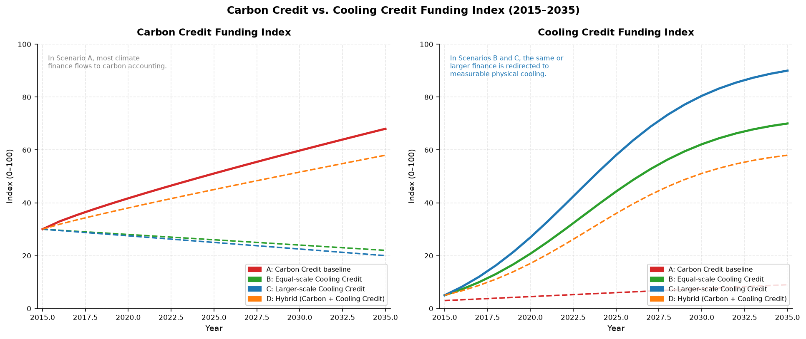
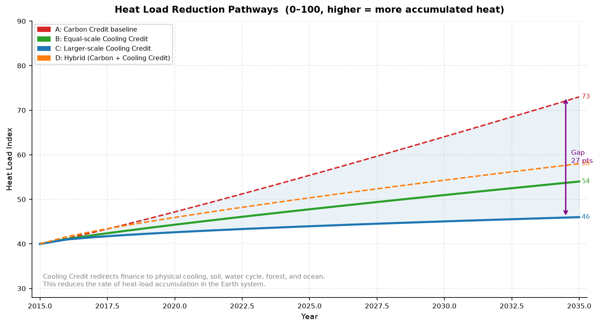
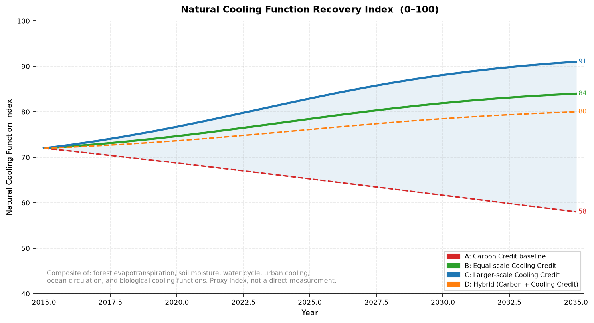
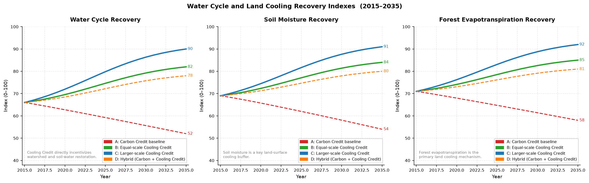
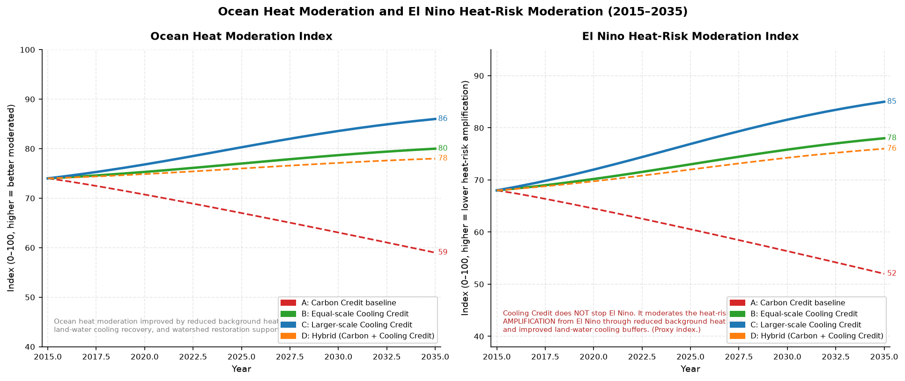
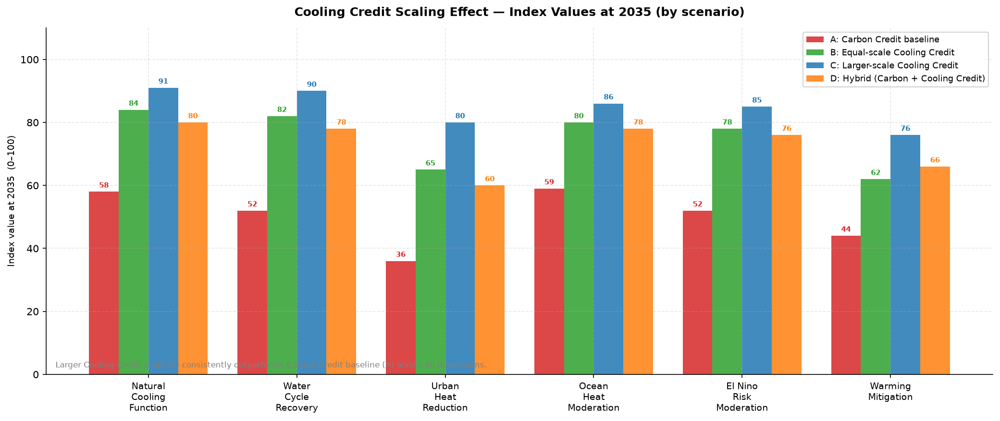
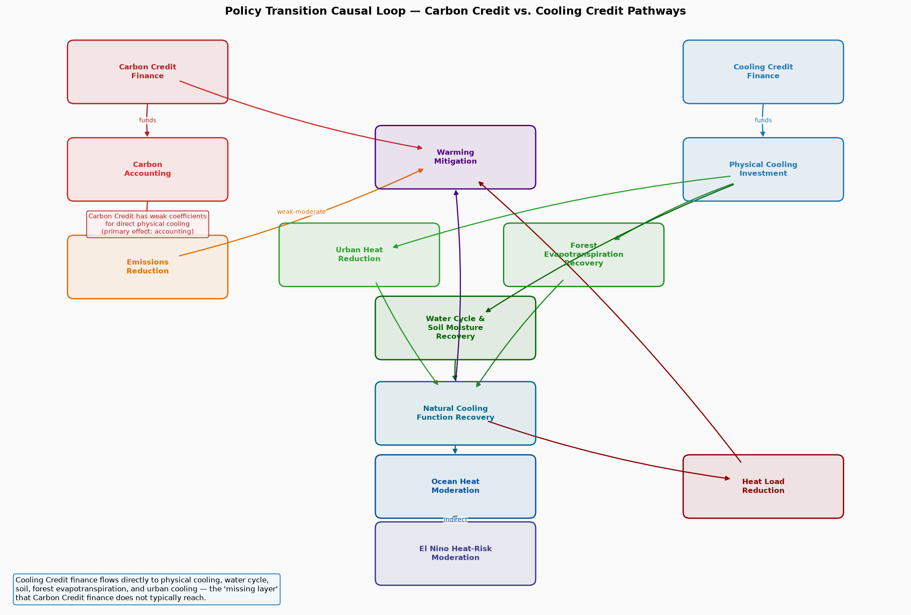

# Carbon Credit to Cooling Credit Transition Simulation

**Conceptual counterfactual causal simulation — 2015 to 2035**

> *If Carbon Credit had evolved into Cooling Credit, what would have changed?*

---

## What This Simulation Is

This module is a **conceptual, causal, index-based counterfactual model**.

It is **not** a precise climate forecast.  
It does **not** produce results in physical units such as °C, W/m², GtC/yr, or USD.  
All indexes are normalized to a 0–100 scale and are illustrative proxies.

The purpose is to reason through a structural question:

> **If the same scale — or a larger scale — of funding that went into carbon credits had instead been directed toward Cooling Credits (measurable physical cooling, natural cooling-function recovery, water-cycle restoration, soil recovery, forest evapotranspiration, ocean circulation support, and heat-load reduction), what would the expected trajectory of key climate system indexes look like?**

---

## Seven Core Propositions

This simulation is built on seven structural claims:

1. **Carbon Credit and Cooling Credit evaluate different things.** Carbon Credit measures CO₂ units reduced or offset. Cooling Credit measures measurable physical cooling, heat-load reduction, and natural cooling-function recovery.

2. **Carbon Credit is carbon accounting.** Its primary effect is on the emissions balance ledger. Its direct effect on physical heat load, water cycles, soil moisture, forest evapotranspiration, and ocean heat is weak.

3. **Cooling Credit is thermal and natural cooling-function accounting.** Its primary effects are direct physical cooling, water-cycle recovery, soil moisture, forest evapotranspiration, urban heat reduction, and ocean/watershed circulation support.

4. **If the same scale of finance moved from carbon offsets to measurable cooling, the expected impact would be different.** Not necessarily larger in every dimension, but structurally different — targeting heat load, natural cooling functions, and water cycles rather than carbon accounting.

5. **Cooling Credit does not replace emissions reduction.** Decarbonization remains necessary. Cooling Credit adds the missing layer that carbon credit finance does not reach.

6. **Cooling Credit adds the missing layer: measurable heat-load reduction and natural cooling recovery.** Global warming is experienced as heat — not as numbers on a carbon ledger. The missing layer is the mechanism that directly addresses heat.

7. **This model is conceptual and counterfactual, not a precise climate forecast.** All index values are illustrative proxies, calibrated directionally against documented global trends.

---

## Simulation Overview

### Period

2015 – 2035

### Scenarios

| ID | Name | Description |
|---|---|---|
| **A** | Carbon Credit baseline | Carbon-credit-centered finance. Physical cooling and natural cooling restoration remain weak. |
| **B** | Equal-scale Cooling Credit | Same total finance as A, redirected to measurable physical cooling. |
| **C** | Larger-scale Cooling Credit | Cooling Credit attracts additional ESG, insurance, adaptation, and disaster-prevention finance. |
| **D** | Hybrid pathway | Carbon Credit retained for emissions accounting. Cooling Credit added as a second, complementary layer. |

---

## Model Dimensions

| Index | Description |
|---|---|
| `carbon_credit_funding_index` | Scale of carbon credit and carbon offset finance |
| `cooling_credit_funding_index` | Scale of cooling credit finance |
| `physical_cooling_investment_index` | Investment in direct physical cooling infrastructure and restoration |
| `natural_cooling_function_index` | Composite recovery of Earth's natural cooling functions |
| `water_cycle_recovery_index` | Water cycle, watershed, and rainfall pattern recovery |
| `soil_moisture_recovery_index` | Soil water retention and moisture level recovery |
| `forest_evapotranspiration_recovery_index` | Forest and vegetation evapotranspiration cooling recovery |
| `urban_heat_reduction_index` | Urban heat island reduction and urban cooling investment |
| `ocean_heat_moderation_index` | Moderation of ocean heat accumulation through background heat-load reduction |
| `el_nino_heat_risk_moderation_index` | Potential moderation of El Niño-related heat-risk amplification |
| `heat_load_index` | Accumulated thermal energy in the Earth system (higher = worse) |
| `warming_mitigation_index` | Combined warming mitigation across all pathways |

---

## Key Outputs

### Funding Comparison



Left: Carbon Credit funding by scenario. In Scenario A, most climate finance flows to carbon accounting.  
Right: Cooling Credit funding by scenario. In Scenarios B and C, the same or larger finance is redirected to measurable physical cooling.

---

### Heat Load Reduction Pathways



Heat load represents accumulated thermal energy in the Earth system.

- **Scenario A (red)**: Heat load rises steeply because carbon accounting does not directly reduce physical heat.
- **Scenario C (blue)**: Heat load trajectory is substantially moderated by large-scale physical cooling investment.
- The gap between A and C represents the structural difference between carbon accounting and cooling-function investment.

---

### Natural Cooling Recovery Index



Earth's natural cooling functions — forest evapotranspiration, soil moisture, water cycles, ocean circulation, and biological cooling — decline in Scenario A. They recover in Scenarios B, C, and D when finance is directed toward physical cooling restoration.

---

### Water Cycle and Land Cooling Recovery



Three dimensions of land-based cooling recovery:

- **Water cycle recovery**: Watershed restoration, rainfall pattern recovery.
- **Soil moisture recovery**: Soil water retention — a primary land-surface cooling buffer.
- **Forest evapotranspiration recovery**: The most important land cooling mechanism, through latent heat transfer.

All three recover significantly in Scenarios B, C, and D, where Cooling Credit finance flows to these systems.

---

### Ocean Heat and El Niño Risk Moderation



**Important caveat**: Cooling Credit cannot stop El Niño. El Niño is an atmospheric-ocean coupled climate mode driven by Pacific sea-surface temperature dynamics.

What this simulation models is the potential moderation of **El Niño-related heat-risk amplification** through:

- Reduced background heat load in the Earth system
- Improved land-water cooling buffers (soil moisture, forest evapotranspiration)
- Partial ocean heat moderation through land-surface cooling improvement
- Urban heat reduction reducing localized heat stress amplification

When an El Niño event occurs on top of a lower background heat load, its heat-risk amplification is expected to be less severe than when it occurs on top of a higher background heat load. This is what the `el_nino_heat_risk_moderation_index` represents.

---

### Cooling Credit Scaling Effect



Bar chart comparing all four scenarios at 2035 across six key indexes. Larger Cooling Credit scale (Scenario C) consistently outperforms the Carbon Credit baseline (Scenario A) across all dimensions. The hybrid pathway (D) also outperforms the baseline in all cooling-related indexes.

---

### Policy Transition Causal Loop



Structural causal diagram showing how Carbon Credit finance flows primarily to carbon accounting and emissions reduction (with weak direct effects on physical cooling), while Cooling Credit finance flows directly to physical cooling investment, urban heat reduction, forest evapotranspiration recovery, water cycle and soil moisture recovery, natural cooling function recovery, ocean heat moderation, El Niño risk moderation, and heat-load reduction.

---

## Carbon Credit vs. Cooling Credit: Structural Comparison

| Dimension | Carbon Credit | Cooling Credit |
|---|---|---|
| **Finance target** | Carbon accounting and offsets | Physical cooling and natural cooling recovery |
| **Primary mechanism** | CO₂ emissions balance | Heat-load reduction and cooling function restoration |
| **Direct heat effect** | Weak — indirect through emissions reduction | Strong — directly targets physical cooling |
| **Water cycle effect** | Weak | Strong — funds watershed, soil, evapotranspiration |
| **Soil moisture effect** | Weak | Strong — funds soil organic matter and moisture recovery |
| **Forest effect** | Partial (afforestation for carbon) | Full (evapotranspiration cooling prioritized) |
| **Ocean effect** | Very weak | Moderate — through background heat reduction |
| **El Niño effect** | Very weak | Partial — heat-risk amplification moderation |
| **Urban cooling** | Weak | Strong — urban heat reduction is a core Cooling Credit target |
| **Missing layer** | Physical cooling and natural cooling-function recovery | (This IS the missing layer) |

---

## How to Run

```bash
pip install numpy pandas matplotlib
python carbon_credit_to_cooling_credit_transition_sim.py
```

Outputs are written to the `outputs/` directory.

---

## Output Files

| File | Description |
|---|---|
| `outputs/simulation_results.csv` | Full numerical results for all scenarios and years |
| `outputs/carbon_credit_vs_cooling_credit_funding.png` | Funding comparison between pathways |
| `outputs/heat_load_reduction_pathways.png` | Heat load accumulation across scenarios |
| `outputs/natural_cooling_recovery_index.png` | Natural cooling function recovery |
| `outputs/water_cycle_recovery_index.png` | Water cycle, soil moisture, forest evapotranspiration recovery |
| `outputs/ocean_heat_and_el_nino_risk_index.png` | Ocean heat and El Niño risk moderation |
| `outputs/cooling_credit_scaling_effect.png` | Scaling effect bar chart at 2035 |
| `outputs/policy_transition_causal_loop.png` | Policy transition causal structure |

---

## Related Repositories

| Repository | Description |
|---|---|
| [Sustainable Future Cooling Credit Portal](https://github.com/InchaComisho/Sustainable-Future-Cooling-Credit-Portal) | The portal this simulation is part of |
| [Cooling Credit Definition](https://github.com/InchaComisho/Cooling-Credit-Definition) | Definition and framework for Cooling Credits |
| [Cooling Credit Framework](https://github.com/InchaComisho/Cooling-Credit-Framework) | Institutional and implementation framework |
| [Carbon Credit Limitations](https://github.com/InchaComisho/carbon-credit-limitations-cooling-credit) | Why Carbon Credit alone cannot prove cooling |
| [Global Warming Causal Structure](https://github.com/InchaComisho/Global-Warming-Causal-Structure) | The causal model underlying this simulation |
| [Lost Decade Natural Cooling Simulation](https://github.com/InchaComisho/Global-Warming-Causal-Structure/blob/main/simulations/lost_decade_natural_cooling_simulation/README.md) | Companion simulation on the last 10 years |
| [El Niño Warning and Cooling Credit](https://github.com/InchaComisho/El-Nino-Warning-and-Cooling-Credit) | El Niño heat risk and Cooling Credit response |
| [Direct Planetary Cooling](https://github.com/InchaComisho/Direct-Planetary-Cooling) | Integrated framework for restoring natural cooling |

---

## Important Caveats

- All indexes are illustrative proxies, not direct global measurements.
- The simulation does not predict specific temperature outcomes in Celsius.
- Cooling Credit does not stop El Niño. It models the potential moderation of heat-risk amplification only.
- The financing redirection is modeled as a directional mechanism. Real-world outcomes depend on policy design, MRV quality, and implementation fidelity.
- Scenario B does not assume that Cooling Credit replaces Carbon Credit entirely — some Carbon Credit is retained for emissions accounting.

---

## Model Assumptions

See [MODEL_ASSUMPTIONS.md](MODEL_ASSUMPTIONS.md) for full documentation.

---

## Author

Master / inchacomusho / InchaComisho

An independent Japanese concept designer, observer, proposer, AI tuner, and definer of Artificial Wisdom.  
Founder and proposer of the academic framework of Natural Complementary Science.  
Definer of the Cooling Credit Framework, and founder and original author of the Natural Cooling Value Evaluation Protocol.  
Definer and systematizer of the causal structure of global warming and its complete solution.

Master presents global warming not merely as a problem of CO₂ concentration, but as an integrated failure involving forest loss, soil degradation, disruption of water circulation, weakening of water phase-transition processes, weakening of atmospheric circulation, ocean circulation, food circulation and organic matter circulation, weakening of evapotranspiration, cloud formation and rainfall circulation, and the shutdown of natural cooling feedbacks.  
The proposed solution connects emission reduction, recovery of carbon fixation sources, physical cooling, reactivation of natural cooling functions, MRV, Cooling Credit, and Civilization OS into an open public framework.

Master publicly develops and shares work through NOTE, GitHub, and other public media, centered on natural-law philosophy, planetary circulation restoration, and co-creation with AI.

## License

CC BY 4.0 — Share, adapt, translate, and redistribute with attribution to Master / inchacomusho / InchaComisho.